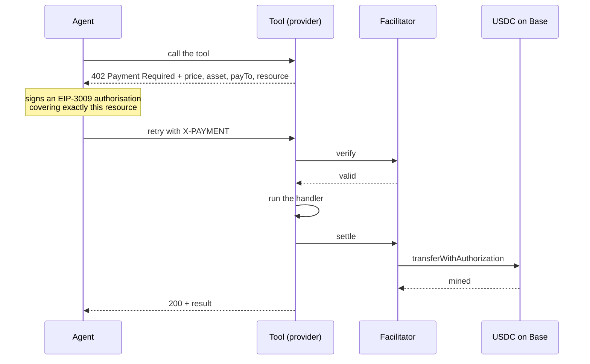

# Fatstack

**A non-custodial marketplace where AI agents discover and pay for API and MCP tool calls
in USDC, per call, over [x402](https://x402.org) on Base.**

A provider lists a tool. An agent finds it in the registry and calls it. The tool answers
`402 Payment Required` with a price. The agent signs a USDC payment authorisation and
retries. The call goes through and the money moves wallet to wallet.

**Fatstack never touches the money.** There is no custody, no withdrawal function, no
platform wallet in the payment path, and no stored private keys. Payment is a direct
transfer from the agent's wallet to the provider's — or, once a provider's promotional
period ends, through an immutable splitter contract that pays the provider and a 2%
platform fee in one atomic transaction. If a change would let Fatstack move someone
else's money, it is a bug.

This repository holds the parts you run, audit, or depend on. The marketplace application
itself is closed; everything an integrator touches is here, under MIT.

---

## The payment cycle



The agent signs an authorisation, not a transaction: it never pays gas and never sends a
transfer itself. The facilitator broadcasts it and pays the gas.

**Payments are final. Once settled on chain the transfer cannot be reversed, and there are
no refunds.** That sentence appears in every 402 body, every quote object, and every
payment-facing page, and it is not decoration — it is the property that makes per-call
pricing work without an escrow.

---

## Quickstart — providers

Put a paywall in front of a route you already have. Two lines of setup, and the price is
per call.

```bash
npm install @fatstack/x402
```

```ts
import { Hono } from 'hono';
import { paywall } from '@fatstack/x402';
import { honoPaywall } from '@fatstack/x402/hono';

const app = new Hono();

app.use(
  '/convert',
  honoPaywall(
    paywall({
      price: '0.001',               // USDC, per call
      wallet: '0xYourWallet',       // paid directly, wallet to wallet
      toolId: 'unit-convert',
      network: 'base-sepolia',      // test here before base
    }),
  ),
);

app.post('/convert', (c) => c.json({ celsius: 20, fahrenheit: 68 }));
```

Adapters ship for Hono, Express and Next on their own entry points —
`@fatstack/x402/hono`, `/express`, `/next` — so importing the client into an edge runtime
does not drag a Node framework in with it.

Full walkthrough, including listing the tool: **[docs/provider-quickstart.md](docs/provider-quickstart.md)**

## Quickstart — agents

Give a model a set of paid tools it can call, with a spending limit it cannot exceed.

```bash
npm install @fatstack/ai-sdk-tools ai viem
```

```ts
import { generateText } from 'ai';
import { fatstackTools } from '@fatstack/ai-sdk-tools';
import { privateKeyToAccount } from 'viem/accounts';

const tools = await fatstackTools({
  wallet: privateKeyToAccount(process.env.AGENT_PRIVATE_KEY),
  networks: ['base-sepolia'],
  guards: {
    maxPerDay: 0.5,                 // hard ceiling per UTC day, in USD
    maxPerCall: 0.01,               // refuse any single call dearer than this
  },
});

const { text } = await generateText({ model, tools, prompt: 'Convert 20C to F.' });
```

`guards` is a required argument with no default. A tool set that can spend money should
never be constructible by accident, so omitting it is a type error rather than an
unlimited budget.

Full walkthrough: **[docs/agent-quickstart.md](docs/agent-quickstart.md)**

---

## What is in here

| Path                       | What it is                                                                 |
| -------------------------- | -------------------------------------------------------------------------- |
| `sdk/`                     | `@fatstack/x402` — provider middleware and agent client                     |
| `integrations/ai-sdk-tools/` | `@fatstack/ai-sdk-tools` — a Vercel AI SDK tool set that pays per call    |
| `contracts/`               | The USDC payment splitter and its factory, with tests and deployment gates  |
| `facilitator/THREAT-MODEL.md` | Written verdicts on six attack classes against the payment path          |
| `docs/`                    | Provider and agent quickstarts, and the registry format                     |

**Packages:** [`@fatstack/x402`](https://www.npmjs.com/package/@fatstack/x402) ·
[`@fatstack/ai-sdk-tools`](https://www.npmjs.com/package/@fatstack/ai-sdk-tools)
**Marketplace:** [fatstack.net](https://www.fatstack.net) ·
**Registry:** [registry.json](https://www.fatstack.net/registry.json)

---

## Security

The payment path was audited against six attack classes — replay, concurrency,
cross-resource substitution, verify/settle ordering, field binding, and misconfiguration.
Each has a written verdict and at least one test that proves the safe behaviour, run
against a real facilitator and real settlements on Base Sepolia rather than mocks.

**[facilitator/THREAT-MODEL.md](facilitator/THREAT-MODEL.md)** has the verdicts.
**[contracts/SECURITY.md](contracts/SECURITY.md)** covers the splitter.

One class came back **vulnerable**, and it is worth reading even if you never use
Fatstack, because it is a property of x402 rather than of this implementation.

### Cross-resource replay

An EIP-3009 authorisation covers `(from, to, value, validAfter, validBefore, nonce)`. It
does **not** cover what was bought. So an authorisation signed to pay for one tool was
accepted by a different, more expensive tool from the same provider — same payee, same
asset, a valid signature, and nothing in the signed material to say otherwise.

Reproduced on Base Sepolia, settled on chain:
[`0xd95ea771333c8f33f346c316fad30a64585156831d09e298d501c5b1e17e5659`](https://sepolia.basescan.org/tx/0xd95ea771333c8f33f346c316fad30a64585156831d09e298d501c5b1e17e5659)

Fixed in `@fatstack/x402` **0.2.0** (current release **0.2.1**, which is the same code
under the correct MIT licence metadata). The middleware now binds a payment to the resource it
was quoted for and refuses a mismatch with `resource_mismatch`, before the facilitator is
called — so a mismatched payment costs nothing and is never settled. Nothing a 402 quotes
to agents changed.

If you built on x402 without checking that the payment in hand was quoted for the resource
in hand, check now.

### The finding that shaped the contract

An earlier draft of the splitter took the provider as a call argument. That argument is not
covered by the payer's signature either, so anyone observing a pending authorisation could
have submitted it with their own address and taken the provider's 98%. The provider is now
fixed at construction — one splitter per provider, its address derivable in advance with
CREATE2 — which removes the parameter and with it the attack.

See *The finding that changed the design* in
[contracts/SECURITY.md](contracts/SECURITY.md).

### Reporting

Found something? Open an issue for anything already public. For an unreported vulnerability
in the payment path, please report privately through GitHub's security advisories on this
repository rather than in a public issue.

---

## The contracts are unaudited

The splitter is small, immutable, and has no owner, no pause, no proxy, and no upgrade
path. It is covered by 34 tests including a fork test against real USDC on Base, and its
fee arithmetic is asserted against the same
[`vectors.json`](contracts/test/vectors.json) as the TypeScript implementation, so an
on-chain split and a quoted price cannot drift apart.

No third party has reviewed it. Read it yourself before depending on it — it is about
fifteen lines of code that move money and a hundred lines explaining why.

## Contributing to this repository

Some files here differ from their counterparts in the closed repository, because operator
detail has been removed. `.redactions` lists them and `scripts/check-redactions.sh` refuses
anything that puts that material back. Run it before pushing.

## Licence

MIT. See [LICENSE](LICENSE).
